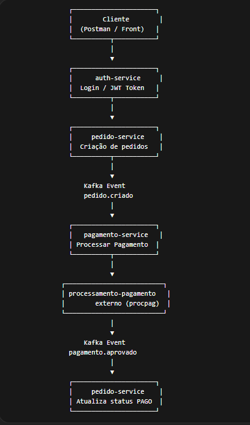

# Repositório base para o projeto da Fase 03

Faça um _fork_ desse projeto, e continue a partir deste.

## Serviço de pagamento eventualmente disponível:

Para ver os endpoints disponiveis, acesse `localhost:8089/openapi.yml`

# Projeto: Tech-challenge-10adjt1 – Fase 03

### Integrantes

Filipe Gonçalves Ferreira - RM367737  
Leandro da Silva Gonçalves - RM367789  

---

# Sistema de Pedido Online - Tech Challenge Fase 3

Este projeto implementa um sistema de pedidos online utilizando **arquitetura de microserviços**, comunicação **assíncrona via Apache Kafka** e **resiliência com Resilience4j**.

---

# Arquitetura do Sistema



O sistema é composto pelos seguintes microserviços:

- **auth-service** → autenticação e geração de JWT
- **pedido-service** → gerenciamento de pedidos
- **pagamento-service** → processamento de pagamentos

Infraestrutura utilizada:

- Apache Kafka
- Zookeeper
- MySQL
- Docker Compose

---

# Fluxo do Sistema

1. Cliente realiza login no **auth-service**
2. O sistema retorna um **token JWT**
3. Cliente cria pedido no **pedido-service**
4. O serviço publica evento Kafka:


pedido.criado


5. **pagamento-service** consome o evento
6. O serviço chama o **serviço externo de pagamento (procpag)**

---

# Caso pagamento aprovado

Evento publicado:


pagamento.aprovado


O **pedido-service** consome o evento e atualiza o pedido para:


PAGO


---

# Caso pagamento falhe

Evento publicado:


pagamento.pendente


O sistema possui um **worker Kafka responsável por reprocessar automaticamente pagamentos pendentes**.

Fluxo:


pagamento.pendente
↓
worker
↓
nova tentativa de pagamento


---

# Tratamento de Falhas

Para garantir resiliência foram implementados:

- Circuit Breaker
- Retry
- Timeout

Utilizando **Resilience4j**.

---

# Idempotência

O serviço de pagamento possui controle de idempotência para evitar:

- processamento duplicado
- pagamentos duplicados

Caso um pagamento já tenha sido aprovado, novas tentativas são ignoradas.

---

# Eventos Kafka

Eventos utilizados no sistema:


pedido.criado
pagamento.aprovado
pagamento.pendente


---

# Executar o Projeto

Subir todo o ambiente:


docker compose up --build


---

# Serviços

| Serviço | Porta |
|------|------|
| auth-service | 8080 |
| pedido-service | 8081 |
| pagamento-service | 8082 |
| serviço externo pagamento | 8089 |

---

# Tecnologias Utilizadas

- Java 21
- Spring Boot
- Spring Security
- Apache Kafka
- Docker
- MySQL
- Resilience4j

---

# Documentação Swagger

Auth Service


http://localhost:8080/swagger-ui/index.html


Pedido Service


http://localhost:8081/swagger-ui/index.html


Pagamento Service


http://localhost:8082/swagger-ui/index.html


---

# Serviço de pagamento externo

Para visualizar a especificação do serviço externo:


http://localhost:8089/openapi.yml


---

# Exemplos de Requisições

## Criar usuário

POST


http://localhost:8080/auth/register


Body

```json
{
  "nome": "Leandro",
  "email": "cliente@teste.com",
  "password": "123456"
}
Login

POST

http://localhost:8080/auth/login
{
  "email": "cliente@teste.com",
  "senha": "123456"
}
Criar Pedido

POST

http://localhost:8081/pedidos

Header

Authorization: Bearer TOKEN

Body

{
  "restauranteId": 1,
  "itens": [
    {
      "produtoId": 1,
      "nome": "Pizza Calabresa",
      "quantidade": 2,
      "preco": 50
    }
  ]
}
Consultar Pedido
GET http://localhost:8081/pedidos/1
Consultar Pedidos do Cliente
GET http://localhost:8081/pedidos

---

# Checklist Final

Use isso para garantir que **não esqueceu nada**.

### Arquitetura

✅ Microserviços separados  
✅ auth-service  
✅ pedido-service  
✅ pagamento-service  

---

### Segurança

✅ JWT  
✅ Login  
✅ Rotas protegidas  
✅ ID do cliente vindo do token  

---

### Kafka

✅ pedido.criado  
✅ pagamento.aprovado  
✅ pagamento.pendente  

---

### Resiliência

✅ Circuit Breaker  
✅ Retry  
✅ Timeout  
✅ Fallback  

---

### Pagamentos

✅ Integração com procpag  
✅ Tratamento do bug HTTP 400  
✅ Idempotência  

---

### Funcionalidades

✅ Criar pedido  
✅ Consultar pedido por ID  
✅ Consultar pedidos do cliente  

---

### Reprocessamento

✅ Worker Kafka  
✅ Reprocessamento automático  

---

### Infraestrutura

✅ Docker Compose  
✅ Kafka  
✅ MySQL  

---

# 🚀 Resultado

O projeto agora está **100% alinhado com os requisitos da Fase 03**.

Arquitetura implementada:

Microservices
Event Driven Architecture
Kafka Messaging
Resilience Patterns
JWT Security
